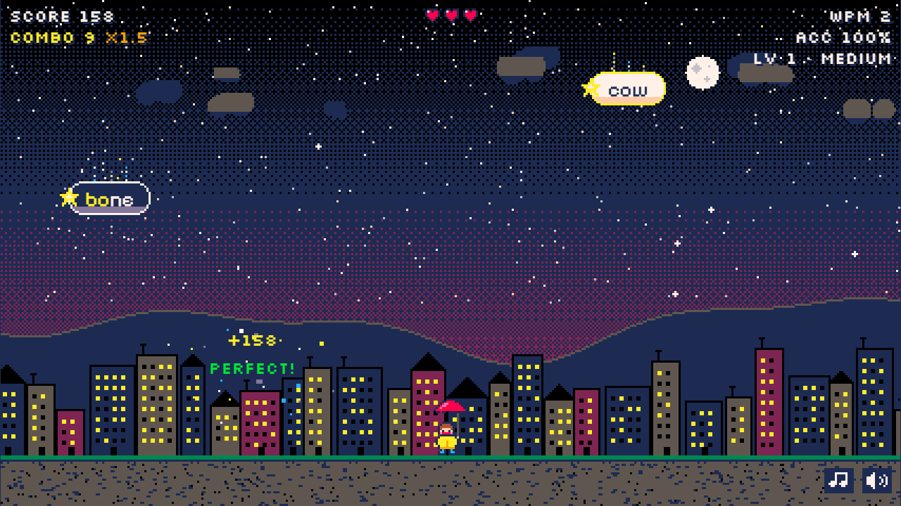
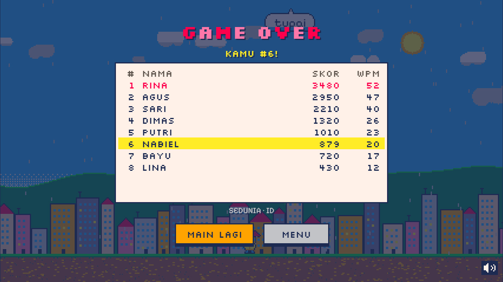

# Letterfall

**A cozy little arcade typing game set in a rainy pixel town.**
Words drop out of the sky. Type them before they hit the ground, keep your combo alive, and climb the worldwide top 10.

▶ **Play it in your browser: [letterfall-eight.vercel.app](https://letterfall-eight.vercel.app/)**


| Start screen | Night shift | Top 10 |
| --- | --- | --- |
|  |  |  |

## What it's like to play

You start on a sunny-but-drizzly afternoon. A kid with a red umbrella waits at the bottom of the screen, and words start falling like raindrops. Just start typing: there's no box to click, and the game figures out which word you're going for.

As the minutes pass the sky turns to dusk and the words catch fire as meteors. Then night falls and they come down as shooting stars, until dawn brings the rain back. Meanwhile everything speeds up, more words crowd the screen, and the long ones start showing up.

Every so often a golden balloon floats by. Type its word and you get a little help: slow motion, a bomb that clears the screen, or an extra heart.

Lose all three hearts and it's game over. If your score is good enough, you get to write your name on the leaderboard.

## Features

**Gameplay**
- **Auto-targeting.** The first letter you type locks onto the matching word closest to the ground. If the letters you've typed also spell the start of another word, the lock simply moves there instead of counting a mistake.
- **Three difficulties.** Easy, Medium and Hard change how fast words fall, how many share the screen, and how long they are.
- **Score and combo.** Points grow with word length and your combo multiplier (up to ×4), with a +50% bonus for words typed without a single mistake.
- **Power-ups** in rare golden balloons: slow-mo, bomb, +1 heart. Missing a balloon costs nothing.

**Stats and leaderboards**
- **Live WPM and accuracy.** WPM uses the standard 1 word = 5 correct characters. The game-over screen shows score, average WPM, peak WPM (best 10-second stretch), accuracy and words cleared.
- **Worldwide top 10**, one board per difficulty and language. If you make the cut, you type your name right on the game-over screen.
- **Personal bests** saved per difficulty and language.

**Two languages**
- **English and Bahasa Indonesia**, each with its own list of ~400 common words grouped by length, so the difficulty feels the same in both. The whole interface switches language too.

**Look and sound**
- **Pixel-perfect art** in the PICO-8 palette, and every sprite is drawn in code:
  - a day → dusk → night → dawn cycle with a dithered sky, parallax clouds and a town whose windows light up after dark
  - word containers that change with the sky: raindrops, meteors and falling stars
  - an umbrella kid who cheers on your combos, panics when a word gets too low, and droops when you lose a heart
- **Game feel:** particle bursts, "+120 / PERFECT! / COMBO x10!" pop-ups, screen shake, rainbow effects on big combos and block-wipe transitions.
- **An original chiptune soundtrack and sound effects**, synthesized live with no audio files. ♫ toggles the music, and the speaker mutes everything.

**Plays anywhere**
- Fills any screen at a crisp integer pixel scale.
- Works on phones: tap to open the keyboard, and the playfield stays above it.

## How to play

| Key | What it does |
| --- | --- |
| `a`–`z` | Type the falling words |
| `Backspace` | Let go of the word you're locked on |
| `Esc` | Pause / resume |
| `Enter` | Start, play again, save your name |
| `←` `→` | Pick difficulty (start screen) or switch leaderboard tab |
| `↑` `↓` | Switch language (start screen) |

|  | Easy | Medium | Hard |
| --- | --- | --- | --- |
| Time for a word to fall (start → late game) | 10.5 s → 5 s | 9 s → 3.5 s | 7 s → 2.8 s |
| Words on screen | 2 → 6 | 3 → 9 | 4 → 12 |
| Word length | mostly short | short to long | long words from the start |

A few tips:
- Clear the lowest words first. Your first letter always locks onto the one closest to the ground.
- A typo breaks your combo but keeps your lock, so just keep typing.
- Bombs are best when the screen gets crowded. You can't hold onto them, but it's satisfying when one shows up at the right moment.

## Under the hood

Letterfall is plain **HTML, CSS and JavaScript** (ES modules) drawn on **Canvas 2D**. There's no framework, no build step, and not a single image or audio file.

- **Crisp pixels at any size.** The background is drawn on a tiny native-resolution canvas and scaled up with `image-rendering: pixelated`. Words, sprites and text go on a full-resolution canvas snapped to the same pixel grid, so the pixel fonts stay sharp.
- **Sprites as code.** Every sprite is an array of strings like `'.18e88881.'`, where each character is a palette color. Each one is baked once into a tiny canvas.
- **Smooth at 60 fps.** Particles live in a fixed pool of typed arrays, so nothing is allocated per frame. With 900 particles on screen at 1080p, frames still average around 8 ms.
- **Retro sky transitions** crossfade between themes with an ordered (Bayer) dither pattern.
- **Music without files.** A small tracker-style sequencer plays the song (pulse-wave lead and arpeggios, triangle bass, noise drums) through the Web Audio API, with a look-ahead scheduler for tight timing.
- **Mobile keyboards.** A hidden input catches keystrokes, and its value is diffed to recover what Android keyboards report as `key: "Unidentified"`.
- **The leaderboard API** ([`api/leaderboard.js`](api/leaderboard.js)) is a single dependency-free Vercel Function that stores scores in Upstash Redis. A browser game can never be cheat-proof, so the server sticks to making cheating annoying:
  - every run gets a one-time token
  - the claimed play time has to match the clock
  - WPM is recalculated and capped
  - the score has to be reachable from what you typed
  - each IP is rate-limited

  Without the API (offline, or on a plain static host), the game quietly falls back to an on-device leaderboard.

## Run it locally

You'll need [Node.js](https://nodejs.org) (for `npx`). ES modules don't load from `file://`, so serve the folder:

```bash
git clone https://github.com/nabielyr/letterfall.git
cd letterfall
npm run dev          # serves the game, open the URL it prints
```

Locally, the leaderboard runs in on-device mode. A few extras:

- `npm run check:words` validates both word lists.
- `?debug=1` shows FPS and game state.
- `?level=5` jumps ahead in difficulty. Runs started this way never reach the leaderboard.
- To try the online leaderboard locally, link the project with `npx vercel link`, pull the env vars with `npx vercel env pull`, and run `npx vercel dev`.

## Deploy your own

1. Import this repository on [Vercel](https://vercel.com). Use framework preset **Other**, with no build command and no output directory. The game is live at that point.
2. For the online leaderboard, open your Vercel project → **Storage** → add **Upstash for Redis** (free plan) and connect it to the project. Then redeploy.

That's it. If you skip step 2, everything still works, with leaderboards saved on each player's device.

## Project structure

```
index.html, css/style.css
api/leaderboard.js     online top-10 boards (Vercel Function + Upstash Redis)
js/
  main.js              boots the game, main loop
  game.js              game states and rules
  config.js            palette and every tuning knob (difficulty, scoring, effects…)
  spawner.js           difficulty curve, picking words and positions
  targeting.js         auto-targeting
  input.js             keyboard + hidden mobile input
  stats.js             WPM, rolling WPM, accuracy
  leaderboard.js       online boards with on-device fallback
  audio.js, music.js   sound effects, mute, the soundtrack
  powerups.js          power-up rolls
  storage.js           saved settings, bests and local boards
  i18n/                interface text (en, id)
  data/                word lists (en, id)
  render/              renderer, sky and town, sprites, words, mascot, HUD, screens, transitions
  fx/                  particles and pop-ups
tools/check-words.mjs  word-list validator
```

## Credits

- Made by **Nabiel Yandra** ([@nabielyr](https://github.com/nabielyr)).
- Color palette: [PICO-8](https://www.lexaloffle.com/pico-8.php) by Lexaloffle.
- Fonts: [Pixelify Sans](https://fonts.google.com/specimen/Pixelify+Sans) and [Silkscreen](https://fonts.google.com/specimen/Silkscreen) from Google Fonts (SIL Open Font License).
- Music, sound effects, art and word lists were made for this project.
