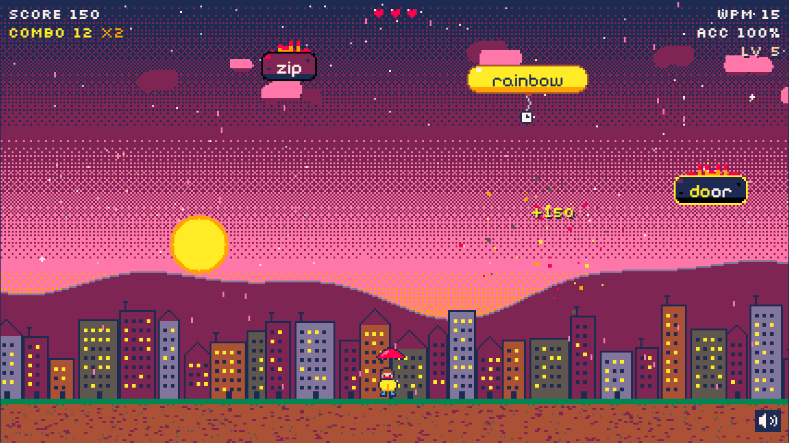
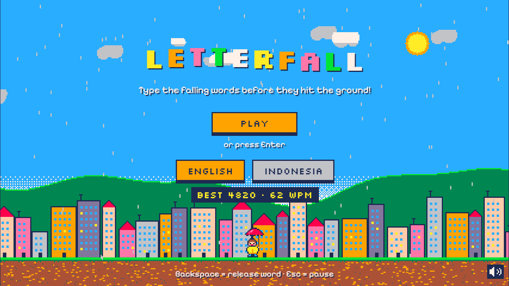
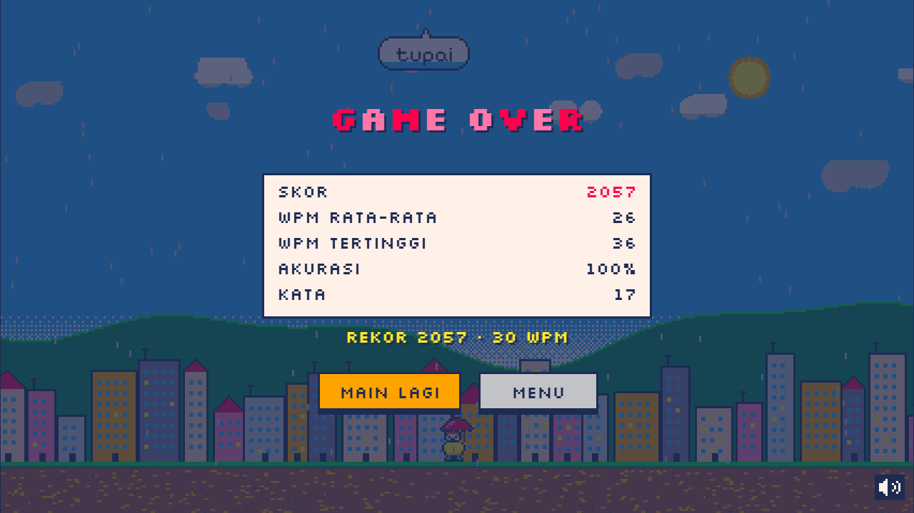

# Letterfall

A cheerful pixel-art typing game. Words rain down on a little town. Type them before they hit the ground!



| Start screen | Game over |
| --- | --- |
|  |  |

## How to play

- **Just type.** There's no text box to click. The first letter locks onto the matching word closest to the ground, and the letters you've typed light up.
- If the letters you've typed also start a different word, the lock moves to that word instead of counting a mistake.
- Finish a word to destroy it. If a word reaches the ground, you lose one of your 3 hearts.
- The game speeds up over time: words fall faster, more of them appear at once, and long words show up more often. At level 5 the raindrops turn into meteors and the sky fades to dusk, then to night at level 8.
- Rare **golden balloons** carry power-ups. Type the word to trigger one:
  - **slow-motion**
  - **bomb**, which clears the screen
  - **+1 life**

  Missing a balloon costs nothing.

| Key | Action |
| --- | --- |
| `a`–`z` | Type |
| `Backspace` | Release the locked word |
| `Esc` | Pause / resume |
| `Enter` | Start / play again |
| `←` `→` | Switch language on the start screen |

On phones, tap the screen to open the keyboard.

## Features

- **Live WPM and accuracy.** WPM uses the standard 1 word = 5 correctly typed characters. The game-over screen shows score, average WPM, peak WPM (best 10-second rolling window), accuracy and words cleared.
- **Score and combo.** Points scale with word length and the combo multiplier (up to ×4), with a +50% bonus for a word typed without mistakes.
- **English and Bahasa Indonesia.** Each language has its own list of 390+ common words, grouped by length so difficulty feels the same in both. The whole UI is translated, and best scores and WPM are kept per language.
- **Pixel-perfect rendering** with the PICO-8 palette:
  - A dithered sky with a sun or moon, three parallax cloud layers, hills, a town whose windows light up at night, and drizzle.
  - An umbrella-kid mascot that cheers on combos, panics when a word gets close to the ground, and droops when you lose a heart.
- **Game feel:**
  - Pixel particle bursts: splashes, embers and confetti.
  - Floating "+120", "PERFECT!" and "COMBO x10!" pop-ups.
  - Screen shake and a red flash when you lose a heart, and rainbow effects at high combos.
  - Block-wipe screen transitions.
- **Chiptune sound effects** synthesized live with the Web Audio API (square and triangle waves plus filtered noise), with a mute button.
- **Responsive.** The game fills any screen at an integer pixel scale and keeps the playfield above the mobile keyboard.

## Tech stack

Vanilla **HTML, CSS and JavaScript** (ES modules), with **Canvas 2D** rendering. There's no framework, no build step and no image or audio files. Every sprite is a pixel array in code, and every sound is synthesized.

Some implementation notes:

- **Two stacked canvases.**
  - A native-resolution background canvas is upscaled with `image-rendering: pixelated`.
  - A full-resolution foreground canvas draws words, sprites and text, snapped to the same world-pixel grid. This keeps the pixel fonts ([Pixelify Sans](https://fonts.google.com/specimen/Pixelify+Sans) and [Silkscreen](https://fonts.google.com/specimen/Silkscreen)) crisp at every scale.
- **Game loop.** `requestAnimationFrame` with a clamped delta time. The game auto-pauses when the tab loses focus.
- **Particles** live in a fixed pool of typed arrays (swap-remove, no per-frame allocation). Sprites, word containers and backgrounds are baked once into offscreen canvases. With a full pool of 900 particles at 1080p, frames average about 8 ms.
- **Theme changes** crossfade with an ordered (Bayer) dither mask, for an authentic retro look.
- **Mobile input** goes through a hidden `<input>`. Its value is diffed to recover keystrokes from virtual keyboards that report `key: "Unidentified"`.

## Project structure

```
index.html, css/style.css
js/
  main.js           boot, game loop, wiring
  config.js         palette, tuning (difficulty, score, effects, power-ups)
  game.js           state machine and gameplay rules
  spawner.js        difficulty curve, word and position picking
  targeting.js      auto-target logic
  input.js          keyboard + hidden mobile input
  stats.js          WPM, rolling WPM, accuracy
  audio.js          chiptune synth
  powerups.js       power-up rolls
  storage.js        localStorage (best scores, language, mute)
  i18n/             UI text: en.js, id.js
  data/             word lists: words.en.js, words.id.js
  render/           renderer, background, sprites, word containers, mascot, HUD, screens, transition
  fx/               particles, pop-ups
tools/check-words.mjs   word-list validator
```

## Run locally

ES modules don't load from `file://`, so serve the folder:

```bash
npm run dev            # npx serve .
npm run check:words    # validate the word lists
```

Debug options in the URL:

- `?debug=1` shows FPS, difficulty and state, and exposes `window.letterfall`.
- `?level=N` starts at level N.

## Deploy

Letterfall is a static site, so no build is needed. Deploy the repository root to **Vercel** (framework preset: *Other*) or **Netlify** (no build command, publish directory `.`), or drag the folder onto Netlify Drop.

## Credits

- Palette: [PICO-8](https://www.lexaloffle.com/pico-8.php) by Lexaloffle.
- Fonts: Pixelify Sans and Silkscreen from Google Fonts (SIL Open Font License).
